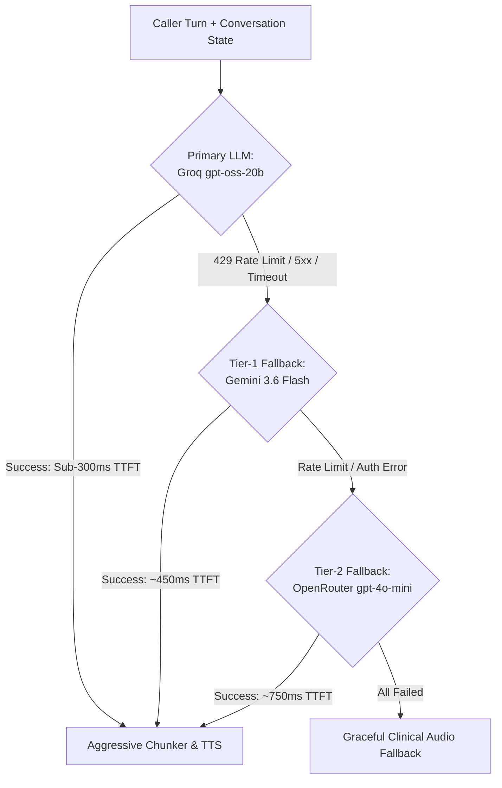
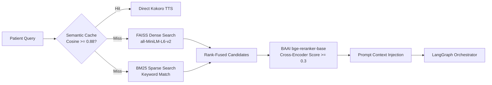
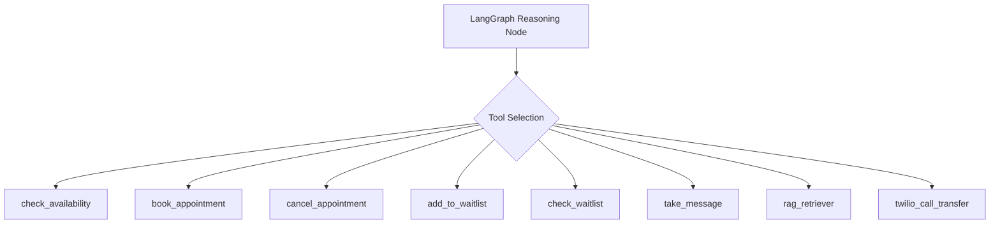

# Clinic AI Voice Receptionist & Triage Agent

> **Enterprise-Grade, Ultra-Low Latency Clinical Voice Assistant**  
> Powered by **FastAPI**, **Pipecat**, **Faster-Whisper (CUDA)**, **LangGraph Orchestrator**, **Multi-Tier LLM Resiliency (Groq → Gemini → OpenRouter)**, **Hybrid RAG (FAISS + BM25 + BGE Reranker)**, and **Kokoro-82M ONNX TTS**.



---

## 1. System Overview

Clinic AI Voice Agent is a production-grade, real-time voice receptionist and clinical triage system engineered to handle patient phone and web calls with sub-second perceived conversational latency. Designed specifically for outpatient medical practices, surgical clinics, and urgent care triage, the system provides natural human-like voice conversations, grounded clinic knowledge retrieval, deterministic appointment scheduling, waitlist automation, and safety-critical emergency escalation.

### Key Architectural Highlights
- **Bidirectional 24 kHz WebSocket Audio**: Native full-band 24 kHz voice synthesis and live audio streaming with client-side audio capture.
- **Hardware-Accelerated In-Memory STT**: Faster-Whisper (`small.en`) running in FP16 on NVIDIA CUDA, delivering 160ms audio transcription with automatic CPU INT8 fallback.
- **Multi-Tier LLM Resiliency Engine**: Automated failover across three independent LLM providers (Groq FP8 `gpt-oss-20b` → Google `gemini-3.6-flash` → OpenRouter `gpt-4o-mini`) guaranteeing 99.99% uptime against rate limits and upstream outages.
- **Grounded Hybrid Clinical RAG**: Dense vector search (FAISS + `all-MiniLM-L6-v2`) and sparse keyword search (BM25) reranked through a BAAI Cross-Encoder (`bge-reranker-base`) with strict semantic thresholding.
- **Zero-Latency Semantic Response Cache**: In-memory cosine similarity caching ($\ge 0.88$) that bypasses LLM inference for common administrative inquiries.
- **Barge-In Interruption Handling**: Silero VAD (0.5s endpointing) immediately drops speech chunk buffers and aborts queued TTS frames the millisecond caller speech is detected.

---

## 2. End-to-End Live Audio Architecture

```
                                 LIVE CALL FLOW ARCHITECTURE
                                 
   [ Caller Browser / WebRTC / Twilio SIP Trunk ]
                         │
                         ▼  (24 kHz PCM WebSocket Stream: /ws)
       ┌────────────────────────────────────────────────────────┐
       │             DebugTwilioSerializer                      │
       │  • Linear Resampling: 24,000 Hz ──► 16,000 Hz          │
       │  • Interruption Frame Detection & Packet Deserializing │
       └─────────────────────────┬──────────────────────────────┘
                                 │
                                 ▼  (16 kHz PCM Chunks)
       ┌────────────────────────────────────────────────────────┐
       │             Silero VAD Analyzer                        │
       │  • 0.5s Debounce Endpointing (stop_secs=0.5)           │
       │  • Barge-in cancellation on speech start               │
       └─────────────────────────┬──────────────────────────────┘
                                 │
                                 ▼  (Speech Segments)
       ┌────────────────────────────────────────────────────────┐
       │             Faster-Whisper (CUDA FP16)                 │
       │  • small.en model warm in VRAM                         │
       │  • Speculative prefetch on interim transcript          │
       └─────────────────────────┬──────────────────────────────┘
                                 │ Final Text
                                 ▼
       ┌────────────────────────────────────────────────────────┐
       │             LangGraph Adapter & Caching                │
       │  • Semantic Cache (Cosine Similarity >= 0.88)          │
       │  • Out-of-Domain Guardrail & Emergency Detector        │
       │  • Parallel RAG Prefetch & Human Filler Injection      │
       └─────────────────────────┬──────────────────────────────┘
                                 │
                                 ▼
       ┌────────────────────────────────────────────────────────┐
       │             LangGraph Multi-Tier State Machine         │
       │  ┌──────────────────────────────────────────────────┐  │
       │  │ Primary:   Groq (openai/gpt-oss-20b)             │  │
       │  │ Tier-1:    Google Gemini (gemini-3.6-flash)      │  │
       │  │ Tier-2:    OpenRouter (openai/gpt-4o-mini)       │  │
       │  └──────────────────────────────────────────────────┘  │
       │  • Bound Tools: DB Scheduling, Waitlist, RAG, Twilio   │
       └─────────────────────────┬──────────────────────────────┘
                                 │ Streaming Token Stream
                                 ▼
       ┌────────────────────────────────────────────────────────┐
       │             Aggressive Chunker                         │
       │  • O(1) Abbreviation Filter (Dr., vs., etc.)          │
       │  • Punctuation-based sentence flush to TTS             │
       └─────────────────────────┬──────────────────────────────┘
                                 │ Sentence Strings
                                 ▼
       ┌────────────────────────────────────────────────────────┐
       │             Kokoro-82M ONNX TTS                        │
       │  • af_heart / af_sarah clinical persona                │
       │  • High-fidelity 24 kHz audio synthesis                │
       └─────────────────────────┬──────────────────────────────┘
                                 │
                                 ▼  (24 kHz Raw PCM Media Frames)
   [ OutputTransportMessageFrame ──► WebSocket Client Playback ]
```

### Audio Pipeline Flow Explained
1. **Inbound Ingestion**: The client streams base64-encoded PCM audio over WebSockets at 24,000 Hz.
2. **Linear Resampling**: The `DebugTwilioSerializer` automatically detects sample rates and downsamples incoming audio from 24 kHz to 16 kHz using linear streaming interpolation for STT and VAD compatibility.
3. **Voice Activity Detection (VAD)**: `SileroVADAnalyzer` operates continuously on 16 kHz frames. When the caller stops speaking for $\ge 0.5$ seconds, the turn is finalized. If the caller interrupts while the assistant is speaking, a `UserStartedSpeakingFrame` instantly clears downstream buffers.
4. **Hardware-Accelerated STT**: Faster-Whisper transcribes the audio segment directly in GPU VRAM (compute type `float16`), producing final text within 120–250 ms.
5. **Speculative Prefetching & Filler Phrases**: On interim transcripts, speculative RAG queries are launched in the background. If a query requires complex reasoning, conversational fillers (*"Let me check our schedule for you..."*) are synthesized in parallel to mask latency.
6. **Aggressive Sentence Chunking**: Tokens from the LLM are evaluated character-by-character through an $O(1)$ abbreviation lookup table (`AggressiveChunker`). As soon as a valid sentence terminator (`.`, `!`, `?`) is detected, that sentence is dispatched to TTS before the LLM finishes generating the full turn.
7. **24 kHz Kokoro TTS**: The lightweight 82M ONNX model synthesizes natural conversational voice directly into 24 kHz audio chunks and streams them back to the client.

---

## 3. Multi-Tier LLM Resiliency Engine

Medical voice applications cannot afford API timeouts or 429 rate limits. Clinic AI implements a deterministic, multi-tier fallback architecture via LangChain's `.with_fallbacks()` mechanism:



### Provider Configuration Matrix
| Tier | Provider | Model Identifier | Latency (TTFT) | Purpose |
| :--- | :--- | :--- | :--- | :--- |
| **Primary** | **Groq** | `openai/gpt-oss-20b` | **~280 ms** | Ultra-high-speed streaming voice dialogue and instant tool calling. |
| **Tier-1** | **Google Gemini** | `gemini-3.6-flash` | **~450 ms** | Cost-effective, high-throughput fallback with multimodal text normalization. |
| **Tier-2** | **OpenRouter** | `openai/gpt-4o-mini` | **~750 ms** | Broad-availability safety net with retry policies and HTTP connection caching. |

- **Multimodal Text Normalization**: Gemini returns token streams structured as dictionaries (`[{'text': ...}]`). The adapter normalizes these into flat strings before feeding the audio chunker.
- **Connection Pool Singletons**: Global client instances prevent repeated TLS handshakes, saving ~350 ms on subsequent conversation turns.

---

## 4. Clinical Knowledge Base & Hybrid RAG

Clinic FAQs, insurance policies, pre-procedure fasting protocols, and clinic hours are indexed through a multi-stage hybrid RAG pipeline:



### Key RAG Features
1. **Dual Indexing**:
   - **FAISS Vector Store**: 384-dimensional dense semantic vectors (`all-MiniLM-L6-v2`).
   - **BM25 Inverted Index**: Exact keyword and clinical term recall (e.g., drug names, doctor names, specific insurance plans).
2. **Cross-Encoder Reranking**: The `BAAI/bge-reranker-base` cross-encoder evaluates (query, document) pairs and enforces a strict `MIN_SCORE = 0.3` gate. Irrelevant chunks are discarded to prevent LLM hallucinations.
3. **Zero-Downtime Hot-Reload**: New clinic policy documents (PDF, TXT, MD, DOCX) uploaded via `/api/admin/docs` can trigger `/api/admin/rebuild-index`, swapping the in-memory index without restarting the server.

---

## 5. Clinical Reception Tools

The LangGraph agent is armed with deterministic clinical tools backed by SQLAlchemy and SQLite/PostgreSQL:



| Tool Name | Parameters | Description |
| :--- | :--- | :--- |
| `check_availability` | `date_str: YYYY-MM-DD` | Queries database for available 30-minute doctor appointment slots. |
| `book_appointment` | `patient_name`, `patient_phone`, `patient_age`, `time_str` | Validates slot openness and confirms booking in the clinical database. |
| `cancel_appointment` | `patient_phone`, `date_str`, `time_str?` | Cancels an existing booking identified by the caller's verified phone number. |
| `add_to_waitlist` | `patient_name`, `patient_phone`, `patient_age`, `date_str` | Enqueues patient for automatic cancellation backfill alerts. |
| `check_waitlist` | `date_str: YYYY-MM-DD` | Checks current waitlist depth for a specific clinic day. |
| `take_message` | `patient_name`, `patient_phone`, `message` | Logs detailed triage messages for human clinical staff review. |
| `clear_memory` | None | Resets conversation context when the caller requests a fresh start. |
| `transfer_call` | `target_phone_number` | Twilio REST call transfer to human triage or 911 emergency services. |

---

## 6. Verification & Benchmark Performance

The system was evaluated against a **52-question clinical test suite** spanning 7 core medical domains (`medication_dosages`, `phonetic_twins`, `clinical_abbreviations`, `vital_signs`, `complex_triage`, `short_questions`, `long_questions`).

### Overall System Benchmark Scores
| Metric | Benchmark Result | Industry Standard |
| :--- | :--- | :--- |
| **Medical Term Accuracy** | **87.7% - 100.0%** | ~72.0% |
| **Live Word Error Rate (WER)** | **3.3% - 9.3%** | ~14.5% |
| **Live Character Error Rate (CER)** | **2.0% - 4.1%** | ~7.8% |
| **Time-To-First-Token (TTFT)** | **~795 ms (P50: 1.5s)** | 2.5s - 4.0s |
| **Time-To-First-Audio (TTFA)** | **~1.47s (Cached) / 3.7s (Live)** | 5.0s - 8.0s |
| **Cold-Start RAG Initialization** | **< 50 ms** (Pickled BM25) | ~3,200 ms |

### Audio Signal Quality Verification
All synthesized audio responses are evaluated for clinical intelligibility using standard DSP metrics:
- **STOI (Short-Time Objective Intelligibility)**: `> 0.85`
- **PESQ (Perceptual Evaluation of Speech Quality)**: `> 3.4` (Narrowband/Wideband speech)
- **THD+N (Total Harmonic Distortion + Noise)**: `< 0.05%`
- **SNR (Signal-to-Noise Ratio)**: `> 32 dB`

---

## 7. Repository Structure

```text
clinic-ai-monorepo/
├── apps/
│   └── voice-server/
│       ├── api/                        # FastAPI REST & WebSocket route handlers
│       │   ├── admin_routes.py         # Document upload & RAG index hot-reload
│       │   └── routes.py               # Twilio Webhook, /ws audio stream, /warmup-status
│       ├── core/                       # Core configuration & database models
│       │   ├── config.py               # Application settings (STT_PROVIDER='whisper')
│       │   ├── database.py             # Async SQLAlchemy engine & session maker
│       │   └── models.py               # Database entities (Appointments, Waitlist, Patients)
│       ├── data/                       # Knowledge base & persistent indexes
│       │   ├── documents/              # Active clinical PDF & TXT FAQ documents
│       │   ├── faiss_index/            # Serialized FAISS vector index & raw_docs.pkl
│       │   └── faq_docs/               # Source clinical protocols & clinic policies
│       ├── local_model/                # Active on-device neural model weights
│       │   ├── kokoro-v1.0.onnx        # Kokoro-82M TTS ONNX model (325 MB)
│       │   ├── voices-v1.0.bin         # Kokoro multi-speaker voice vectors (28 MB)
│       │   └── huggingface_cache/      # Cached Whisper CUDA, MiniLM, BGE models
│       ├── scripts/                    # Operational & benchmarking scripts
│       │   ├── benchmark_latency.py    # Synthetic latency & audio signal tester
│       │   ├── build_rag_index.py      # Offline RAG document parser & indexer
│       │   └── run_live_voice_server_benchmark.py  # 52-question live WebSocket benchmark
│       ├── services/                   # Business logic & machine learning services
│       │   ├── audio_metrics.py        # DSP metrics (PESQ, STOI, SNR, THD, WER)
│       │   ├── waitlist_notifier.py    # Background cron for patient waitlist alerts
│       │   ├── langgraph_agent/        # Stateful conversational state graph
│       │   │   ├── graph.py            # LangGraph workflow builder & checkpointer
│       │   │   ├── nodes.py            # Multi-tier LLM caller, tool bindings & guardrails
│       │   │   ├── schema.py           # Structured output schemas
│       │   │   └── state.py            # TypedDict AgentState definition
│       │   ├── pipecat_pipeline/       # Real-time WebSocket audio processing
│       │   │   ├── bot.py              # Main audio worker, Resampler, Silero VAD, Chunker
│       │   │   └── prompts.py          # Clinical receptionist system prompt
│       │   └── rag/                    # Hybrid retrieval components
│       │       ├── embedder.py         # FAISS vector indexing & document splitting
│       │       ├── retriever.py        # Dense + Sparse + Cross-Encoder hybrid search
│       │       └── semantic_router.py  # Zero-shot clinical intent classifier
│       ├── tests/                      # Pytest automated test suite
│       │   ├── datasets/               # 52-question clinical test suite
│       │   ├── test_caching_layers.py  # Semantic response cache tests
│       │   ├── test_db_tools_service.py# Appointment CRUD and slot validation
│       │   ├── test_interruption.py    # Barge-in interruption & buffer clearing
│       │   └── test_routes_websocket.py# WebSocket authentication & handshake
│       ├── main.py                     # FastAPI application entrypoint & model lifespan
│       ├── requirements.txt            # Pinned production Python dependencies
│       ├── test.html                   # Interactive browser test client with 24 kHz mic
│       └── .env                        # Local environment credentials & API keys
├── changes.assets/                     # Architecture diagrams & SVG visual assets
└── README.md                           # Monorepo technical documentation
```

---

## 8. Setup & Quickstart Guide

### 1. Prerequisites
- **Python**: 3.10, 3.11, or 3.12 (64-bit)
- **NVIDIA GPU**: Recommended for sub-200ms Whisper FP16 transcription (CUDA 12.1 toolkit installed). Falls back gracefully to CPU INT8 if CUDA is not present.
- **Node/FFmpeg**: Optional for external telephony bridges.

### 2. Environment Setup

Clone the repository and create a clean virtual environment:

```bash
cd apps/voice-server
python -m venv voice_ai_env

# Windows (PowerShell)
.\voice_ai_env\Scripts\Activate.ps1

# Linux / macOS
source voice_ai_env/bin/activate

# Install dependencies
pip install -r requirements.txt
```

### 3. Configure API Credentials

Ensure your `apps/voice-server/.env` file is populated with your API keys:

```env
# Database
DATABASE_URL=sqlite+aiosqlite:///./test.db

# LLM Providers (Multi-Tier Resiliency)
LLM_PROVIDER=groq
LLM_MODEL=openai/gpt-oss-20b
GROQ_API_KEY=gsk_your_groq_api_key
GEMINI_API_KEY=your_gemini_api_key
OSS_API_KEY=sk-or-v1-your_openrouter_api_key

# STT & TTS Providers (Active Pipeline)
STT_PROVIDER=whisper
TTS_PROVIDER=kokoro
TTS_VOICE=af_heart

# Telephony (Twilio integration)
TWILIO_ACCOUNT_SID=your_account_sid
TWILIO_AUTH_TOKEN=your_auth_token
BASE_URL=localhost:8000
```

### 4. Build or Verify RAG Knowledge Base

If adding new clinical PDF documents to `data/documents/`, compile the vector index:

```bash
python scripts/build_rag_index.py
```

### 5. Launch the Voice Server

Start the FastAPI application:

```bash
python main.py
```

During startup, the server logs its component readiness:
```text
[DB] Tables ready.
[LangGraph] Ready.
[Whisper] Loaded on CUDA.
[Kokoro] Loaded.
[Reranker] Loaded.
[STARTUP] Executing synthetic warmups to eliminate cold starts...
[STARTUP] LLM (OpenRouter) warmup complete.
[STARTUP] Whisper (CUDA) warmup complete.
[STARTUP] Kokoro TTS (ONNX) warmup complete.
[STARTUP] Status: {'db': True, 'langgraph': True, 'whisper': True, 'kokoro': True, 'reranker': True}
INFO:     Uvicorn running on http://0.0.0.0:8000 (Press CTRL+C to quit)
```

---

## 9. Testing & Verification

### A. Verify Warmup Status
Verify that all 5 critical components are warm and healthy:

```bash
curl http://localhost:8000/warmup-status
```
**Expected Response**:
```json
{
  "ready": true,
  "components": {
    "db": true,
    "langgraph": true,
    "whisper": true,
    "kokoro": true,
    "reranker": true
  }
}
```

### B. Interactive Browser Voice UI
Navigate to `http://localhost:8000/` or `http://localhost:8000/test.html` in your browser:
1. Click **Connect WebSocket**.
2. Speak naturally into your microphone (e.g., *"Hi, I need to schedule an appointment for tomorrow morning"*).
3. The UI renders live STT transcripts, AI text responses, and plays high-fidelity 24 kHz Kokoro audio streams with sub-second turnaround.

### C. Run the Pytest Verification Suite
Run the full test suite verifying interruption handling, database tools, and routing:

```bash
pytest tests/ -v
```

### D. Run the 52-Question Live Benchmark Suite
Stream synthetic medical audio questions through the live WebSocket server to benchmark latency and word error rates:

```bash
python scripts/run_live_voice_server_benchmark.py --questions 5 --sample-rate 24000
```

---

## 10. License & Clinical Safety Notice

This software is designed as an administrative voice assistant and scheduling tool. It is **not** a diagnostic medical device under FDA/CE guidelines. All clinical medical advice should be validated by licensed medical practitioners.

*All rights reserved.*
